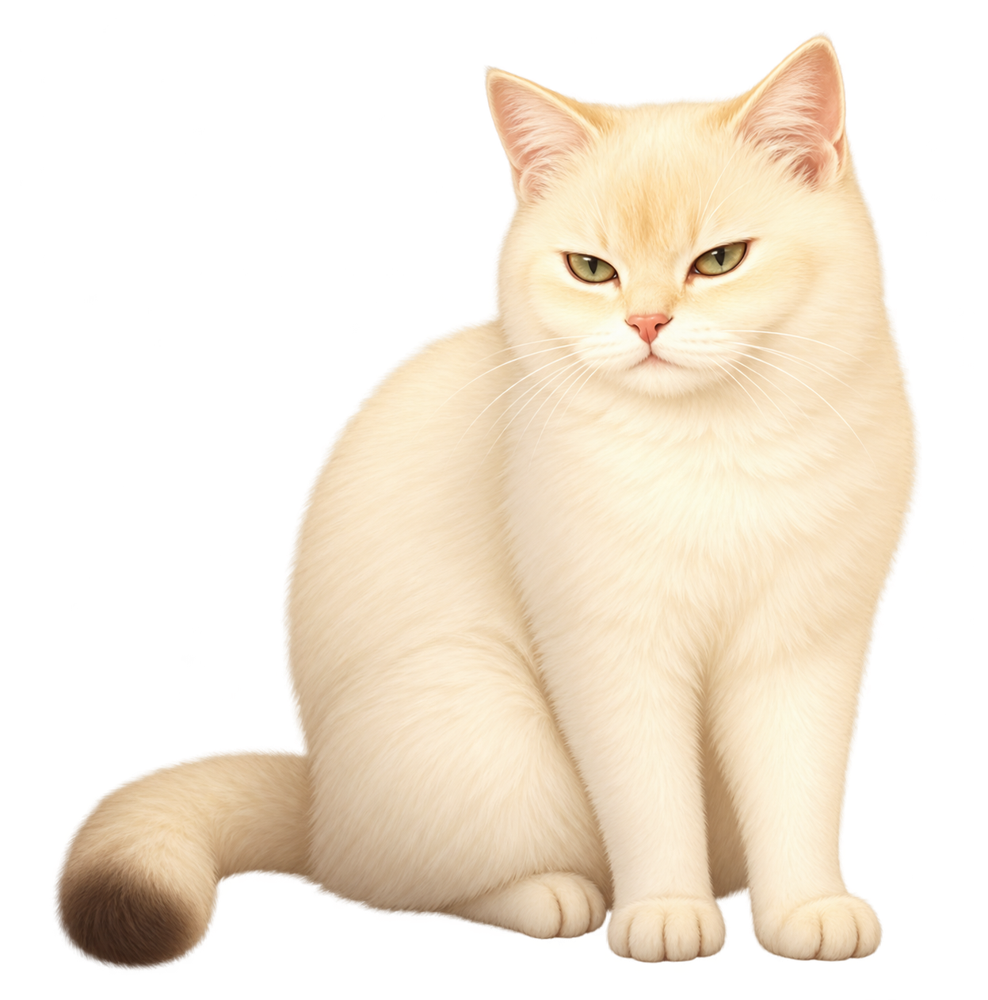

# 啾啾 · 宠物陪伴待办

> 完成一件小事，也让啾啾开心一点。

一款面向移动端的宠物陪伴待办 Web App：用户通过完成任务获得啾啾金币，用金币购买食物、玩具并与宠物互动，将日常管理转化为温和、持续的正反馈。

[在线体验](https://huang-jiujiu-pet-todo-bea.baixi443.chatgpt.site/) · [产品源码](https://github.com/baixi443-create/huang-jiujiu-pet-todo)

<p align="center">
  
</p>

## 项目亮点

- **任务驱动的养成闭环**：创建任务、完成任务、获得金币、购买或使用物品、获得啾啾反馈。
- **轻量而有回应的宠物系统**：饱食度、心情、等级与互动状态都会随用户操作变化；低状态会以温和提示表达，不产生惩罚性后果。
- **有真实感的互动反馈**：喂食与互动会随机展示啾啾的不同反应，使用玩具、食物和摸摸均有独立效果与库存逻辑。
- **时间与任务管理**：支持优先级、分类、截止日期与时间、重复任务、逾期警示及任务完成排序。
- **成长与数据看板**：记录任务完成率、每周趋势和宠物状态；当饱食度或心情分别累计达到满值时，啾啾升级。
- **移动端体验**：采用响应式界面、固定底部导航、PWA manifest 与 Service Worker，可从 iPhone Safari 添加到主屏幕使用。

## 核心功能

| 模块 | 已实现内容 |
| --- | --- |
| 今日 | 待办按优先级展示、完成任务沉底、右滑删除、金币奖励与截止时间提醒 |
| 清单 | 按分类查看任务，支持筛选与任务管理 |
| 宠物 | 啾啾状态、喂食、互动、摸摸、等级成长与随机情绪反馈 |
| 商店与背包 | 购买逗猫棒、猫粮等物品；购买入库、使用消耗、库存为零自动隐藏 |
| 我的 | 今日完成率、周任务趋势、晚间宠物状态汇总与等级进度 |

## 设计思路

这个项目重点不是把待办事项“游戏化得更有压力”，而是在完成现实任务时提供陪伴感。任务奖励采用分级金币机制；宠物状态会自然衰减，但不会死亡、消失或强制惩罚用户。这样既保留目标感，也避免给忙碌时的用户增加负担。

## 技术实现

- 原生 **HTML / CSS / JavaScript**，无框架依赖
- 浏览器 `localStorage` 持久化任务、金币、背包、宠物状态与看板数据
- Service Worker + Web App Manifest 提供基础 PWA 离线能力与主屏安装入口
- 纯静态资源部署，适合 GitHub Pages、静态托管平台或本地 Web Server

## 本地运行

这是一个无需构建步骤的静态项目。建议通过本地 HTTP 服务启动，以便 Service Worker 正常工作：

```bash
python -m http.server 8000 --directory dist
```

然后访问 `http://localhost:8000`。

## iPhone 使用方式

1. 在 Safari 打开[在线体验](https://huang-jiujiu-pet-todo-bea.baixi443.chatgpt.site/)。
2. 点击底部分享按钮。
3. 选择“添加到主屏幕”。

## 项目结构

```text
dist/
├── index.html              # 主界面
├── pet-todo.html           # 宠物与任务页面
├── dashboard.js            # 任务看板与等级逻辑
├── pet-care.js             # 宠物状态、背包、互动逻辑
├── food-items.js           # 商店物品配置
├── manifest.webmanifest    # PWA 配置
├── sw.js                   # Service Worker
└── *.png                   # 啾啾及互动视觉资源
```

## 隐私说明

项目不要求注册或登录。任务、宠物状态和背包数据仅保存在当前浏览器的本地存储中；清除浏览器网站数据会重置这些本地记录。

## 作品信息

产品设计、交互设定与宠物视觉素材由 Bea 提供与主导。本仓库用于作品展示；其中的啾啾照片及相关视觉素材未经许可不得转载或商用。